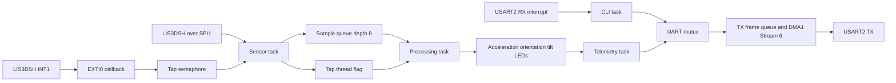
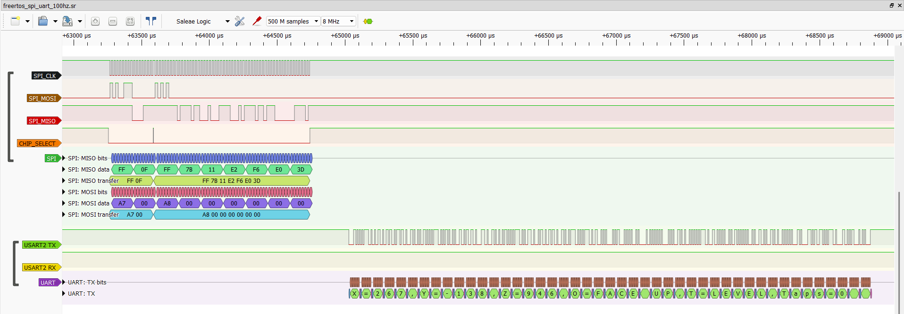

# STM32F407 Motion Logger

**Author:** R.S. Hari Naveen

This project reads the onboard LIS3DSH accelerometer on an STM32F407 Discovery board and turns the samples into orientation, tilt and double-tap information. I first implemented the application as a bare-metal superloop and then moved the same functional blocks into a FreeRTOS design. Keeping both versions in this repository makes the design change easier to study.

The sensor communicates through SPI1. USART2 provides a small command-line interface and continuous telemetry, with interrupt-driven receive and DMA-based transmit. The four board LEDs indicate tilt direction and flash together when the LIS3DSH hardware state machine reports a double tap.

## Main features

- LIS3DSH three-axis acceleration in mg
- Face orientation and tilt direction
- Hardware double-tap detection through LIS3DSH State Machine 1 and EXTI0
- Runtime output-data-rate selection at 25, 50, 100 and 400 Hz
- USART2 command-line interface at 115200 baud
- Interrupt-driven RX ring buffer and queued DMA transmission
- Bare-metal and CMSIS-RTOS2 FreeRTOS implementations
- One-hour FreeRTOS soak test with queue, UART, heap and stack monitoring
- PulseView captures for SPI and bidirectional UART

## Repository layout

```text
project-1-motion-logger/
|-- bare-metal/              STM32CubeIDE bare-metal project
|-- freertos/                STM32CubeIDE FreeRTOS project
|-- docs/
|   |-- architecture.md
|   |-- build-and-run.md
|   |-- from-bare-metal-to-freertos.md
|   |-- validation-results.md
|   |-- evidence/
|   |   |-- logic-analyzer/
|   |   `-- soak-test/
|   `-- report/
|       |-- STM32F407_Motion_Logger_Project_Report.md
|       `-- STM32F407_Motion_Logger_Project_Report.docx
|-- .gitignore
`-- THIRD_PARTY_NOTICES.md
```

## Hardware and interfaces

| Function | Peripheral and pin |
| --- | --- |
| LIS3DSH chip select | PE3 |
| SPI1 clock | PA5 |
| SPI1 MISO | PA6 |
| SPI1 MOSI | PA7 |
| LIS3DSH INT1 | PE0 and EXTI0 |
| USART2 TX | PA2 |
| USART2 RX | PA3 |
| Tilt LEDs | PD12 to PD15 |

## CLI commands

```text
help
read
status
rate 25
rate 50
rate 100
rate 400
monitor on
monitor off
clear
```

`read` returns the latest acceleration, orientation, tilt and tap count. `status` reports the requested and actual sensor rate together with application and UART counters.

## FreeRTOS data flow



More detail is available in [architecture.md](docs/architecture.md) and [from-bare-metal-to-freertos.md](docs/from-bare-metal-to-freertos.md).

## Validation summary

The final FreeRTOS build completed in both Debug and Release configurations with zero errors and zero warnings. The bare-metal Release configuration also completed with zero errors and zero warnings.

During an approximately one-hour FreeRTOS soak test, the sensor rate was changed through 25, 50, 100 and 400 Hz. The final debugger snapshot recorded:

| Measurement | Result |
| --- | ---: |
| Sensor reads | 506,818 |
| Samples delivered and processed | 506,816 |
| Sensor queue drops | 2 |
| UART frames queued | 33,475 |
| UART DMA completions | 33,475 |
| Telemetry frames dropped | 0 |
| UART DMA errors | 0 |
| UART TX queue-full events | 0 |
| UART RX overflows | 0 |
| Current and minimum-ever free heap | 6,864 bytes |
| Stack overflow detections | 0 |
| Allocation failure detections | 0 |
| Tap ISR events and processed taps | 35 and 35 |

The two sensor queue drops are upstream acquisition samples, not UART telemetry-frame drops. The measured sensor delivery rate was approximately 99.9996 percent.

Full results, including the separate manual tap test, are documented in [validation-results.md](docs/validation-results.md).

The complete student project report is available as [Markdown](docs/report/STM32F407_Motion_Logger_Project_Report.md) and as an editable [Word document](docs/report/STM32F407_Motion_Logger_Project_Report.docx).

## Captured interfaces

The following FreeRTOS capture shows an SPI sensor transaction and UART telemetry within the same acquisition.



The raw `.sr` and `.pvs` files are included so the sessions can be opened and inspected in PulseView.

## Building and running

Both folders are independent STM32CubeIDE projects. Import the required folder as an existing project, build it, program the STM32F407 Discovery board, and open USART2 at 115200 8-N-1. Detailed steps are in [build-and-run.md](docs/build-and-run.md).

## Notes

- The bare-metal and FreeRTOS folders should be imported separately.
- The FreeRTOS project includes STM32 HAL, CMSIS and FreeRTOS sources generated or supplied through STM32CubeIDE.
- The project-level source is provided as portfolio and educational work. Third-party components retain their original licences; see [THIRD_PARTY_NOTICES.md](THIRD_PARTY_NOTICES.md).
