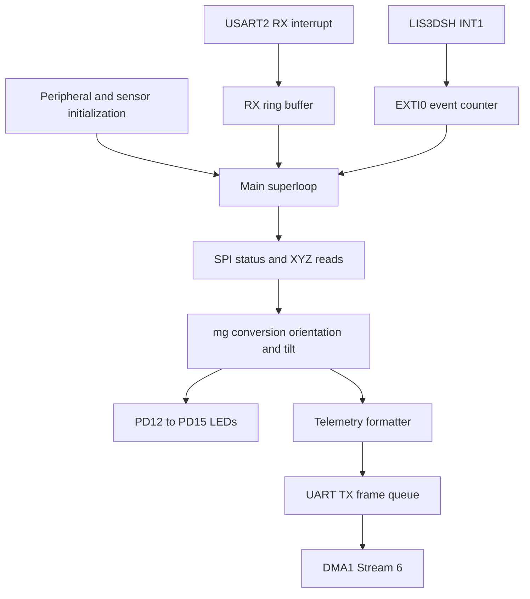
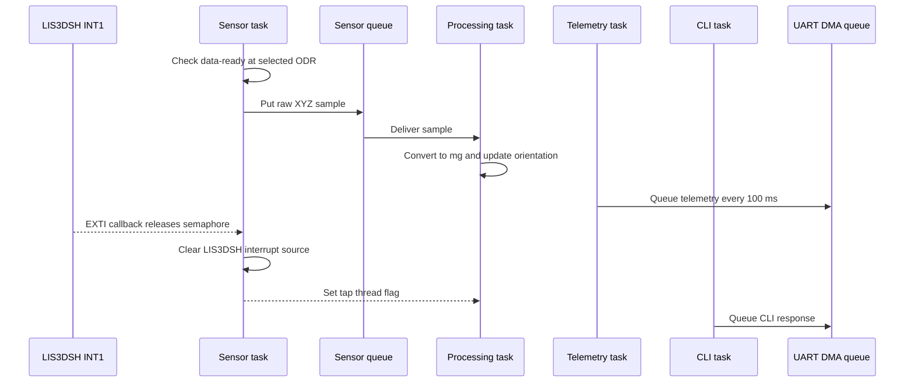

# Motion Logger Architecture

## System purpose

The firmware reads motion from the LIS3DSH accelerometer fitted to the STM32F407 Discovery board. Each sample is converted to mg, filtered for orientation, classified for tilt and exposed through LEDs and a UART terminal. The LIS3DSH hardware state machine detects double taps and raises its INT1 output on PE0.

## Shared functional modules

The two implementations use the same basic application modules:

| Module | Responsibility |
| --- | --- |
| `lis3dsh` | Sensor initialization, register access, XYZ burst reads, ODR changes and tap-state-machine setup |
| `orientation` | Filtered face orientation from acceleration |
| `motion_detection` | Tilt direction and readable tilt names |
| `cli` | Line-oriented commands and formatted responses |
| `uart_async` | Interrupt-driven RX, framed TX queue and DMA completion handling |
| `board` | LEDs and board-level pin setup |
| Custom drivers | Register-level RCC, GPIO, SPI and USART support |

The FreeRTOS version adds `sensor_port`, a small interface between the tasks and the LIS3DSH driver. This kept sensor-specific calls out of the task logic and made the queue payload explicit.

## Bare metal architecture

The bare-metal firmware is controlled by one superloop in `Src/Project1.c`.

The interrupt handlers remain short. The USART ISR copies incoming bytes to the ring buffer, the DMA ISR advances the transmit queue, and EXTI0 records a tap event. The main loop performs the SPI register access needed to clear the sensor interrupt.

## FreeRTOS architecture

The FreeRTOS version separates acquisition, processing, telemetry and command handling.

### Synchronization choices

**Sensor queue.** The queue transfers a complete raw sample from the sensor task to the processing task. Its depth is eight. A failed non-blocking put increments `g_sensorQueueDropCount`, which made overload visible during the soak test.

**Sensor mutex.** The sensor task normally owns SPI access. The CLI also needs SPI when reading the real ODR register or changing ODR and tap timing, so both paths use the sensor mutex.

**Tap semaphore.** The EXTI callback cannot perform SPI work safely. It increments the ISR counter and releases a binary semaphore. The sensor task consumes the semaphore, clears the sensor's latched interrupt and updates the accepted tap count.

**Thread flag.** After the sensor task accepts a tap, it sets a flag on the processing task. That task turns on all four LEDs for a rate-independent 200 ms indication.

**UART mutex.** The telemetry and CLI tasks both submit complete frames to the same asynchronous UART queue. The mutex prevents concurrent producers from modifying the queue state at the same time.

## UART data path

USART2 runs at 115200 baud. RXNE interrupts place bytes into a 256-byte power-of-two ring buffer. A task or the superloop removes those bytes and passes them to the CLI parser. TX frames are copied into an eight-entry queue and sent by DMA1 Stream 6. The completion interrupt advances the queue and starts the next frame.

Counters are provided for received bytes, RX overflow, queued frames, DMA completions, DMA errors and queue-full events. These counters were part of the long-run validation rather than being debug-only print statements.

## LIS3DSH tap handling

Double-tap recognition is implemented in LIS3DSH State Machine 1. Changing the output data rate also changes the tap timing registers. The firmware disables EXTI0 during this update, waits for the sensor settings to settle, reads the latched interrupt source and clears pending EXTI/NVIC state before enabling the interrupt again. This avoids counting a stale level as a new tap after a rate change.

