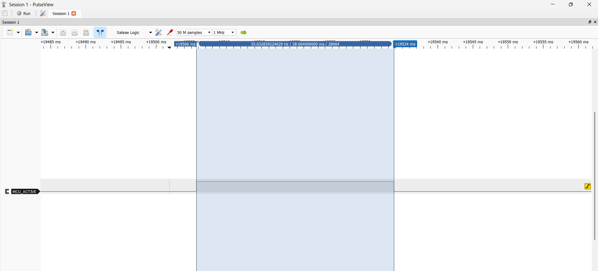
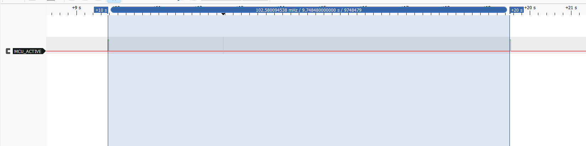
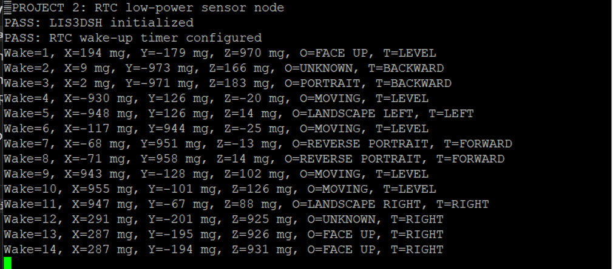

# STM32F407 Bare-Metal Low-Power Sensor Node

This project turns the STM32F407 Discovery board into a periodic low-power motion and orientation sensor. The firmware spends most of its time in Stop mode, wakes from the RTC wake-up interrupt, takes one fresh LIS3DSH accelerometer sample, reports the result over USART2, and returns to Stop mode.

The application is written in bare-metal C. Peripheral registers are configured through custom drivers instead of STM32 HAL or an RTOS.

**Author:** R S Hari Naveen  
**Board:** STM32F407 Discovery, MB997-F407VGT6-E01  
**MCU:** STM32F407VGT6  
**Sensor:** On-board LIS3DSH accelerometer

## What the project demonstrates

- STM32F407 Stop mode using the low-power regulator
- Flash power-down during Stop mode
- RTC wake-up timer driven by the internal LSI clock
- RTC wake-up interrupt routing through EXTI line 22 and the NVIC
- `WFI`, `DSB`, and `ISB` use around low-power entry
- SPI communication with the on-board LIS3DSH accelerometer
- Sensor power-down between measurements
- Removal of the first sample after restarting the sensor
- Orientation and tilt classification from acceleration data
- USART2 telemetry through an external USB-to-UART adapter
- PE0 activity marker for logic-analyser timing measurements
- Current measurement through the board's JP1 IDD link

## Operating sequence

1. Initialize USART2, LEDs, SPI1, the LIS3DSH, the filters, and the PE0 timing marker.
2. Put the LIS3DSH into power-down mode.
3. Select LSI as the RTC clock and configure the RTC wake-up timer.
4. Enter STM32 Stop mode with the low-power regulator and Flash power-down enabled.
5. Wake through `RTC_WKUP_IRQHandler` when the RTC event reaches EXTI line 22.
6. Drive PE0 high to mark the active interval.
7. Start the LIS3DSH at 100 Hz, discard the first sample, and read the next fresh sample.
8. Convert raw acceleration to mg, then calculate orientation and tilt.
9. Put the LIS3DSH back into power-down mode and transmit one UART record.
10. Drive PE0 low and return to Stop mode.

## Main measurements

| Measurement | Result |
|---|---:|
| Stop current at JP1 | 1.752 mA average |
| Continuously active current at JP1 | 9.63 mA average |
| Active time per wake-up | 28.064 ms average |
| Measured wake period | 9.74848 s |
| Active duty cycle | 0.288% |
| Estimated average MCU current | 1.775 mA |
| Reduction from continuously active operation | 81.6% |

The current was measured through JP1, so these values represent the STM32 MCU supply path rather than the total current consumed by every component on the Discovery board. The calculated average uses the measured active and Stop currents together with the logic-analyser duty cycle.

### Active-time marker

PE0 is high while the CPU performs sensor acquisition, processing, and UART transmission. It is low while the MCU is in Stop mode.



### Wake period

The measured interval was 9.74848 seconds. The firmware uses the internal LSI oscillator, whose frequency is approximate, so the measured period is expected to differ slightly from the nominal ten seconds.


The complete PulseView session is included for independent inspection:

[Download the raw PulseView capture](docs/captures/mcu-active-rtc-wake-cycle-10s.sr)

Open the `.sr` file using PulseView. The capture contains the PE0 `MCU_ACTIVE` signal used to measure the active pulse width and RTC wake interval.

### UART output

Each successful wake-up produces the wake count, acceleration in mg, orientation, and tilt state.



## Hardware connections

The LIS3DSH and its SPI connections are already present on the Discovery board. For the console, connect an external USB-to-UART adapter as follows:

| STM32F407 pin  | USB-to-UART adapter |
|--------------- |---------------------|
| PA2, USART2 TX | RX                  |
| PA3, USART2 RX | TX, optional for this transmit-only demonstration |
| GND            | GND                 |

Use 3.3 V logic levels. Do not connect the adapter's 5 V supply pin to the board. The serial settings are **115200 baud, 8 data bits, no parity, 1 stop bit**.

For timing measurements, connect logic-analyser channel 0 to **PE0** and connect the analyser ground to board ground. Name the channel `MCU_ACTIVE`.

## Building and running

1. Open STM32CubeIDE.
2. Choose **File > Import > Existing Projects into Workspace**.
3. Select this repository folder and import the project.
4. Build the project and flash it through the on-board ST-LINK.
5. End the debug session before evaluating low-power current.
6. Open a serial terminal at 115200 baud to observe the measurements.

The final low-power configuration uses `ACTIVE_CURRENT_TEST` set to `0U` in `Src/Project2.c`. Setting it to `1U` intentionally keeps the CPU running and is only intended for the continuously active current reference measurement.

## Project structure

```text
Inc/       Application headers
Src/       Main application, board support, sensor and processing code
drivers/   Bare-metal GPIO, SPI, USART, RCC, RTC, PWR and related drivers
Startup/   STM32F407 startup assembly
docs/      Measurement report and captured evidence
docs/captures/   Original PulseView logic-analyser session
```

Some reusable driver files came from the earlier motion-logger project. The low-power application in `Src/Project2.c` does not use the older CLI or double-tap path during its wake-sense-sleep cycle.

## Measurement notes

The full calculation and raw readings are recorded in [docs/MEASUREMENTS.md](docs/MEASUREMENTS.md).

## References

- [STM32F4xx reference manual RM0090](https://www.st.com/resource/en/reference_manual/rm0090-stm32f4xx-reference-manual-stmicroelectronics.pdf)
- [STM32F407 datasheet](https://www.st.com/resource/en/datasheet/stm32f407ve.pdf)
- [STM32F4 Discovery user manual UM1472](https://www.st.com/resource/en/user_manual/um1472-stm32f4-discovery-stmicroelectronics.pdf)
- [LIS3DSH datasheet](https://www.st.com/resource/en/datasheet/lis3dsh.pdf)

